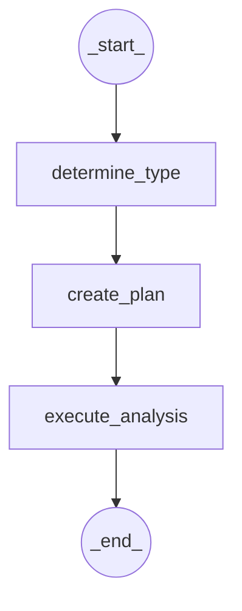

# DeepAgent Financial Systems with LangGraph

An advanced AI-powered financial research platform built with LangChain, LangGraph, and OpenAI models. This system provides institutional-quality financial analysis using real-time market data and sophisticated multi-agent architectures.

## 🚀 Overview

DeepAgent Financial Systems is a comprehensive financial analysis platform that leverages cutting-edge AI technology to provide real-time market insights, portfolio analysis, and investment research. The system combines the power of OpenAI's language models with real-time financial data to deliver professional-grade financial analysis.

## ✨ Key Features

### 📊 Real-Time Financial Data
- **Live Market Data**: Real-time stock prices, market indices, and financial metrics via YFinance
- **Historical Analysis**: Comprehensive historical price analysis and technical indicators
- **Financial Statements**: Access to company financial statements and fundamental metrics
- **Portfolio Analytics**: Advanced portfolio performance analysis and risk assessment
- **Market Intelligence**: Real-time market overview and sector analysis

### 🤖 Specialized AI Agents
- **Stock Analyst**: Individual equity research and valuation analysis
- **Portfolio Manager**: Asset allocation and optimization strategies
- **Risk Assessor**: Quantitative risk analysis and stress testing
- **Market Researcher**: Market trends and sector intelligence gathering

### 🧠 Advanced Capabilities
- **Multi-Agent Orchestration**: Sophisticated task delegation and coordination
- **Persistent Context**: Virtual file system for maintaining analysis continuity
- **Strategic Planning**: TODO-based workflow management for complex research
- **Web Search Integration**: Real-time market intelligence and news analysis
- **Professional Reports**: Institutional-quality research report generation

## 🏗️ Architecture

### Progressive Learning Modules

The system is designed with 5 progressive modules that build upon each other:

1. **Basic Financial Agent** - ReAct loops with financial tools
2. **TODO Planning Agent** - Task planning and workflow management
3. **File System Agent** - Context persistence and memory
4. **Sub-Agent Delegation** - Specialized expert coordination
5. **Deep Research Agent** - Complete institutional research platform

### Technology Stack

- **AI Framework**: LangChain + LangGraph
- **Language Models**: OpenAI GPT-4, GPT-4-mini, GPT-3.5-turbo
- **Financial Data**: YFinance for real-time market data
- **Web Search**: Tavily for market intelligence
- **Tracing**: LangSmith for observability and debugging

## 🔄 LangGraph Workflow

The DeepAgent Financial Systems operates through a structured LangGraph workflow to process financial queries. This sequential process ensures a systematic approach from understanding the user's request to executing the analysis and providing insights.



**Workflow Steps:**
1. **_start_**: Initiates the financial analysis process
2. **determine_type**: Analyzes the user's query to identify the specific type of financial analysis required (e.g., stock price, historical data, portfolio analysis)
3. **create_plan**: Develops a detailed plan for executing the identified analysis, outlining the necessary steps and tools
4. **execute_analysis**: Executes the plan using specialized financial tools and OpenAI models to retrieve and process real market data
5. **_end_**: Concludes the workflow, providing the final analysis or insights to the user

## 🛠️ Installation

### Prerequisites

- Python 3.8 or higher
- OpenAI API key
- (Optional) Tavily API key for web search
- (Optional) LangSmith API key for tracing

### Setup

1. **Clone the repository**
```bash
   git clone <repository-url>
   cd DeepAgents_Financial_with_LangGraph
   ```

2. **Create virtual environment**
   ```bash
   python3 -m venv venv
   source venv/bin/activate  # On Windows: venv\Scripts\activate
   ```

3. **Install dependencies**
```bash
pip install -r requirements.txt
   ```

4. **Configure environment variables**
   Create a `.env` file in the project root:
   ```env
   OPENAI_API_KEY=your_openai_api_key_here
   TAVILY_API_KEY=your_tavily_api_key_here  # Optional
   LANGSMITH_API_KEY=your_langsmith_api_key_here  # Optional
   LANGSMITH_TRACING=true  # Optional
   LANGSMITH_PROJECT=deepagent-financial-systems  # Optional
   ```

## 🚀 Usage

### Quick Start

Run the main application:
```bash
python main.py
```

### LangGraph Studio

To run the graph in LangGraph Studio UI:

1. **Start LangGraph Studio:**
   ```bash
   langgraph dev
   ```

2. **Access the Studio UI:**
   - Open your browser and go to `http://localhost:8123`
   - You'll see the interactive graph visualization

3. **Run Analysis:**
   - Use the input examples provided below
   - Watch the graph execute through all nodes
   - View real-time financial analysis results

### Available Options

- **Progressive Learning Modules**: Start with basic agents and progress to advanced multi-agent systems
- **Quick Start**: Jump directly to the Deep Research Agent for full capabilities
- **Demo Mode**: Run guided demos with sample financial scenarios

### Example Queries

- "Get the current stock price and analysis for Apple (AAPL)"
- "Compare the risk metrics of Tesla (TSLA) vs the S&P 500"
- "Analyze a portfolio with 40% AAPL, 30% MSFT, and 30% GOOGL"
- "What's the current market sentiment based on major indices?"

### LangGraph Studio Input Examples

When running the graph in LangGraph Studio UI, you need to provide input in a specific JSON format. Here are some examples:

#### **Apple Stock Analysis:**
To get the current stock price and analysis for Apple (AAPL):
```json
{
  "messages": [
    {
      "content": "Get the current stock price and analysis for Apple (AAPL)",
      "type": "human"
    }
  ]
}
```

#### **Tesla Stock Performance:**
To analyze Tesla (TSLA) stock performance and provide investment insights:
```json
{
  "messages": [
    {
      "content": "Analyze Tesla (TSLA) stock performance and provide investment insights",
      "type": "human"
    }
  ]
}
```

#### **Portfolio Analysis:**
To create a portfolio analysis for 40% AAPL, 30% MSFT, and 30% GOOGL:
```json
{
  "messages": [
    {
      "content": "Create a portfolio analysis for 40% AAPL, 30% MSFT, and 30% GOOGL",
      "type": "human"
    }
  ]
}
```

#### **Market Sentiment:**
To get the current market sentiment based on major indices and VIX data:
```json
{
  "messages": [
    {
      "content": "What's the current market sentiment based on major indices and VIX data?",
      "type": "human"
    }
  ]
}
```

#### **Risk Analysis:**
To compare risk metrics between NVIDIA (NVDA) and the S&P 500:
```json
{
  "messages": [
    {
      "content": "Compare risk metrics between NVIDIA (NVDA) and the S&P 500",
      "type": "human"
    }
  ]
}
```

## 📊 Financial Tools

The system includes comprehensive financial analysis tools:

- **Stock Price Analysis**: Real-time price data and technical analysis
- **Historical Data**: Historical price analysis and trend identification
- **Portfolio Analysis**: Multi-asset portfolio performance evaluation
- **Risk Metrics**: Beta, Alpha, Sharpe ratio, and Value at Risk calculations
- **Market Overview**: Real-time market sentiment and index analysis

## 🔧 Configuration

### Model Configuration

The system uses multiple OpenAI models optimized for different tasks:

- **Default Model**: GPT-4-mini for general analysis
- **Reasoning Model**: GPT-4 for complex reasoning tasks
- **Fast Model**: GPT-3.5-turbo for quick responses

### Rate Limiting

Built-in rate limiting ensures compliance with API limits while maintaining optimal performance.

## 📈 Data Sources

- **Primary**: YFinance for real-time market data
- **Secondary**: Tavily for web search and market intelligence
- **Analysis**: OpenAI models for financial reasoning and analysis

## 🛡️ Security & Privacy

- All API keys are stored securely in environment variables
- No financial data is stored permanently
- All analysis is performed in real-time with temporary data processing

## 🤝 Contributing

We welcome contributions! Please feel free to submit issues, feature requests, or pull requests.

## 📄 License

This project is licensed under the MIT License - see the LICENSE file for details.

## ⚠️ Disclaimer

**Important**: This software is for educational and research purposes only. It is not intended for actual financial trading or investment decisions. The information provided by this system should not be considered as financial advice. Always consult with qualified financial professionals before making investment decisions.

**No Warranty**: This software is provided "as is" without warranty of any kind. The authors and contributors are not responsible for any financial losses or damages that may result from the use of this software.

**Data Accuracy**: While we strive to provide accurate financial data, we cannot guarantee the accuracy, completeness, or timeliness of the information provided. Market data is subject to change and may not reflect real-time conditions.

## 🙏 Acknowledgments

- **LangChain**: For the powerful AI framework and agent orchestration capabilities
- **OpenAI**: For providing state-of-the-art language models that power the financial analysis
- **YFinance**: For reliable real-time financial market data
- **Tavily**: For web search capabilities and market intelligence
- **LangSmith**: For observability and debugging tools

## 📞 Support

For questions, issues, or contributions, please:
- Open an issue on GitHub
- Check the documentation
- Review the configuration guide

---

**Built with ❤️ for the financial AI community**
